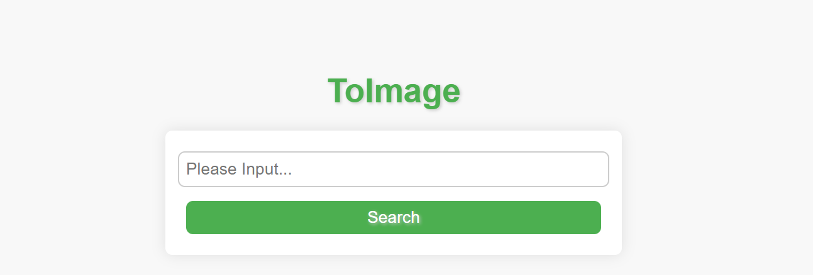

# Docker 镜像推送工具



本工具使用 Docker 客户端和 AWS SDK for Go 推送 Docker 镜像到 Amazon ECR 仓库。推送过程中会自动获取 AWS 账户的认证信息，并使用认证信息登录 Amazon ECR。

## 安装

- 安装 Docker 客户端，安装方法请参考官方文档：https://docs.docker.com/engine/install/

- 安装 AWS SDK for Go，安装方法请参考官方文档：https://docs.aws.amazon.com/sdk-for-go/v1/developer-guide/setting-up.html

## 使用
- 在 main 函数中配置 Docker 镜像信息，包括 Docker 镜像名称和标签。
- 运行程序，程序会自动获取 AWS 账户的认证信息，并使用认证信息登录 Amazon ECR。
- 程序会将 Docker 镜像推送到 Amazon ECR 仓库，并在推送过程中显示推送进度。

## 依赖
- Docker 客户端
- AWS SDK for Go

## service文件
```
sudo vim /etc/systemd/system/toimage.service
[Unit]
Description=my toimage daemon service
 
[Service]
Type=simple
Restart=always
RestartSec=5s
User=root
WorkingDirectory=/home/ec2-user/toimage
ExecStart=/home/ec2-user/toimage/toimage
 
[Install]
WantedBy=multi-user.target
```